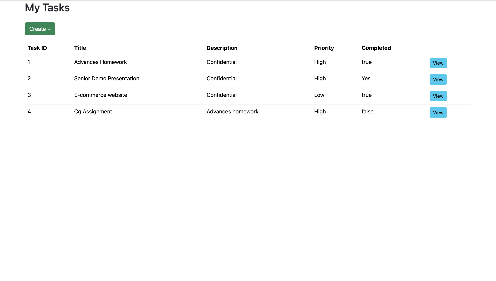

## Project Overview: Task Management Redux

This documentation provides an overview of the taskSlice created with Redux Toolkit. This slice manages a list of tasks, enabling operations such as adding, updating, deleting, and filtering tasks based on priority. Tasks are also persisted in local storage to maintain state across browser sessions.

The platform's main features include:

- **Add Task**: Add a new task to the state and local storage.
- **Update Task**: Update existing tasks based on the given task ID.
- **Delete Task**: Remove tasks from the state and update local storage accordingly.
- **Filter Task**: Filter tasks based on priority (e.g., High, Medium, Low).
- **Local Storage Integration**: Automatically load and save tasks to local storage for persistence.

## Table of Contents

- [Demo](#Demo)
- [Technologies Used](#technologies-used)
- [Getting Started](#getting-started)
- [Installation](#installation)

## Demo

Click on the image to watch the demo video

## Technologies Used

- **React**: JavaScript library for building user interfaces, particularly single-page applications. It offers a component-based architecture, making it simple to build reusable and dynamic user interfaces.
- **React Router**: routing library for React that allows you to define navigation and routing in a single-page application (SPA)..
- **Redux**: predictable state management library for JavaScript apps. It helps manage complex application states consistently across components.

## Getting Started

To get started with the project follow these steps:

## Prerequisites

  1 - npm (Node Package Manager)

    npm install node

## Installation

  1 - Clone repository

    git clone https://github.com/elsoukicarol/my-task-manager.git

  2 - Install libraries/packages

    npm install

## Contributors
Carol El Souki
